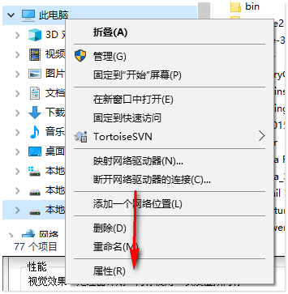
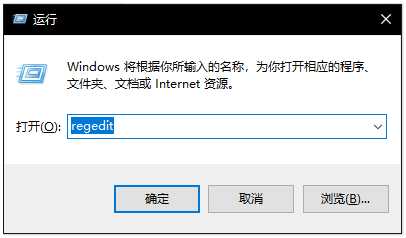

# Mysql 绿色版--下载 & 配置 & 卸载

## 下载 Mysql
1. 登录官方下载网址：[Mysql 官网下载](https://dev.mysql.com/downloads/mysql/)。  
   如下图点击下载免安装版。  
     
2. 如果有帐号，可以选择登录帐号，然后下载。这里选择更简单的一种方式，免登录下载，点击下图所示链接即可开始下载。  
     

## 配置  
由于是免安装版本，所以下载完之后直接进行必要的配置即可使用，配置方法如下：  
1. 解压下载完的安装包，解压路径随意（这里我解压到 E:\mysql-8.0.19-winx64），在解压后的根目录下（以我的为例，即为 E:\mysql-8.0.19-winx64）新建一个 data 文件夹备用。**注意**：data 文件夹必须为空。如下图所示，  
     
2. 再次回到 Mysql 根目录（E:\mysql-8.0.19-winx64）。由于官网从 5.7.18 开始之后都不在二进制包中提供 my-default.ini 文件，所以这就需要我们自行创建一个 my.ini 文件（如果有 my-default.ini 文件，复制一份，把名称修改成 my.ini 即可），在根目录创建 my.ini 文件。  
     
3. 把下面的数据复制到上面创建的 my.ini 文件中，  
   ```
   # For advice on how to change settings please see
   # http://dev.mysql.com/doc/refman/5.7/en/server-configuration-defaults.html
   # *** DO NOT EDIT THIS FILE. It's a template which will be copied to the
   # *** default location during install, and will be replaced if you
   # *** upgrade to a newer version of MySQL.

   [mysqld]
   #skip-grant-tables
   # Remove leading    # and set to the amount of RAM for the most important data
   # cache in MySQL. Start at 70% of total RAM for dedicated server, else 10%.
   # innodb_buffer_pool_size = 128M

   # Remove leading    # to turn on a very important data integrity option: logging
   # changes to the binary log between backups.
   # log_bin

   # These are commonly set, remove the    # and set as required.
   # basedir = .....
   # datadir = .....
   # port = .....
   # server_id = .....
   basedir ="E:\mysql-8.0.19-winx64"      # 设置mysql的安装目录
   datadir ="E:\mysql-8.0.19-winx64\data"      # 设置mysql数据库的数据的存放目录，必须是data，或者是//xxx/data

   # Remove leading    # to set options mainly useful for reporting servers.
   # The server defaults are faster for transactions and fast SELECTs.
   # Adjust sizes as needed, experiment to find the optimal values.
   # join_buffer_size = 128M
   # sort_buffer_size = 2M
   # read_rnd_buffer_size = 2M

   sql_mode=NO_ENGINE_SUBSTITUTION,STRICT_TRANS_TABLES

   #服务端的编码方式
   character-set-server=utf8mb4
   [client]
   #客户端编码方式，最好和服务端保存一致
   loose-default-character-set=utf8mb4

   [WinMySQLadmin]
   Server = "E:\mysql-8.0.19-winx64\bin\mysqld.exe"
   ```  
   这里有**三处地方**需要修改为你自己的配置：  
   1. basedir ="E:\mysql-8.0.19-winx64" # 设置mysql的安装目录  
   2. datadir ="E:\mysql-8.0.19-winx64\data" # 设置mysql数据库的数据的存放目录，必须是data，或者是//xxx/data  
   3. Server = "E:\mysql-8.0.19-winx64\bin\mysqld.exe" # 设置你自己 mysql 数据库的 mysqld.exe 文件的存放目录  
   设置完成后，效果如下图所示：  
     
4. 配置 Mysql 的运行环境  
   1. 设置环境变量，遵循下图的流程设置.  
   选中 我的电脑 → 鼠标右键 → 属性 (R) → 高级系统设置 → 环境变量 (N)  进行环境配置  
     
     
     
   1. 双击用户环境变量的 PATH 属性，点击新建 (N) 按钮，输入你刚刚安装 Mysql 中 bin 文件夹的路径，例如：我的 bin 文件夹的路径是 E:\mysql-8.0.19-winx64\bin，再点击确定。  
     
   也可以设置系统变量的 PATH 属性，方法与上基本一致。  
5. 以**管理员身份**打开 “命令行窗口”，输入命令 `mysqld --initialize-insecure --user=mysql`。  
   执行这条命令需要花一定的时间 (大概几秒，根据电脑情况)，不会有返回结果，但是可以在 MySQL 的安装目录下看到，原本为空的 data 文件夹里面有了许多文件和文件夹。如下图所示：  
     
6. 输入命令 `mysqld -install`  
   当看到 `Service successfully installed` 时，表示 Mysql 服务添加成功。  
7. 输入命令 `net start mysql`，启动 Mysql 服务。  
   以上 3 条指令的输入和执行结果如下所示：  
     
8. 登录 mysql 后，修改密码（**默认密码为空**）  
   1. 以**管理员身份**打开 “命令行窗口”，输入 `mysql -uroot -p` 并按下回车键  
   2. 在弹出 `Enter password:` 时，继续按下回车键，即可登录 mysql  
   3. 输入命令 `use mysql;`  
   4. 输入命令 `ALTER USER 'root'@'localhost' IDENTIFIED WITH mysql_native_password BY ' 新密码 ';` （**注意末尾要有分号**）  
   5. 输入命令 `flush privileges;`  
   6. 输入命令 `exit;`  
     
   1. 使用新密码登录 Mysql，登录成功即可，如下图  
     

## 卸载  
1. 关闭 Mysql 服务。  
   关闭服务可以使用命令行，也可以在「任务管理器」的「服务」里进行关闭，也可以用命令行关闭：**管理员身份**运行命令行（cmd）: `net stop mysql`  
     
2. 删除 Mysql 的注册表。  
   Win+R 打开运行界面，在输入框中输入 regedit 进入系统注册表窗口。  
     
   分别在以下目录中找到 MySQL 的注册表，鼠标右键直接删除 MySQLD Service 目录中的 EventMessageFile 和 TypesSupported 两个文件。如果对应的目录中没有，就不用删除。  
   ```
   HKEY_LOCAL_MACHINE/SYSTEM/ControlSet001/Services/Eventlog/Application/MySQLD Service
   HKEY_LOCAL_MACHINE/SYSTEM/ControlSet002/Services/Eventlog/Application/MySQLD Service
   HKEY_LOCAL_MACHINE/SYSTEM/CurrentControlSet/Services/Eventlog/Application/MySQLD Service
    ```  
   也可以搜索注册表：在系统注册表窗口选择「编辑」— 选择「查找」— 输入 「MySQL」进行查找，将找到的 MySQLD Service 目录中的 EventMessageFile 和 TypesSupported 两个文件进行删除。  
     
3. 移除 Mysql 服务。  
   1. 以管理员身份使用命令行 (cmd) 进入 MySQL 的 bin 目录下；  
   2. 执行移除 MySQL 服务的命令 : `mysqld -remove`；  
   3. 当看到有 `Service successfully removed` 时，则表示移除 Mysql 服务成功。  
      
4. 将 Mysql 安装目录下的文件全部删除即可。  

